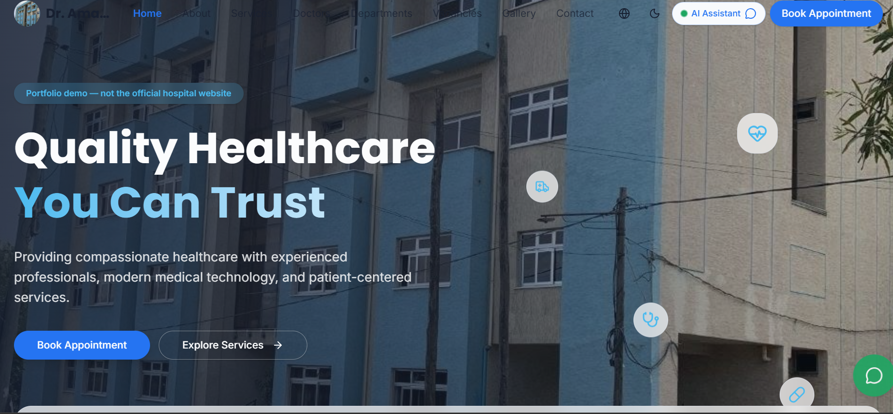

# Dr. Amanuel Hospital Website

🌐 **Live Site:** [https://amanuelhospital.netlify.app/](https://amanuelhospital.netlify.app/)

---

## 📸 Screenshots

<div align="center">
  
  <p><em>Homepage with multilingual support and modern design</em></p>
  
  
  <p><em>Services and features showcase</em></p>
</div>

---

## 📋 Description

A modern, multilingual hospital website for **Dr. Amanuel Hospital** in Bishoftu, Ethiopia. The website provides comprehensive information about medical services, doctors, departments, and facilities with full support for three languages: English, Amharic (አማርኛ), and Afaan Oromo.

### Key Features

- **🌍 Multilingual Support** - Complete translations in English, Amharic, and Afaan Oromo
- **🤖 AI Assistant** - Intelligent chatbot powered by Groq API to answer patient questions 24/7
- **📱 Responsive Design** - Optimized for mobile, tablet, and desktop devices
- **⚡ Modern Tech Stack** - Built with React, TanStack Start, and Tailwind CSS for optimal performance
- **📺 Media Integration** - Featured video coverage from OBN Television
- **🔗 Social Media** - Connected to Facebook and Telegram for easy patient communication
- **♿ Accessible** - Designed with accessibility best practices

### Pages

- **Home** - Hero section, services overview, featured doctors, testimonials, and FAQ
- **About** - Hospital history, mission, values, achievements, and timeline
- **Services** - Comprehensive medical services including emergency care, surgery, laboratory, pharmacy, and more
- **Doctors** - Meet our experienced medical team with specializations and availability
- **Departments** - Detailed information about medical departments
- **Gallery** - Visual showcase of facilities and equipment
- **Contact** - Location, hours, contact information, and appointment booking

---

## 🚀 Technology Stack

- **Framework:** [TanStack Start](https://tanstack.com/start) (React SSR)
- **Styling:** [Tailwind CSS v4](https://tailwindcss.com/)
- **UI Components:** [Radix UI](https://www.radix-ui.com/)
- **Language Management:** React Context API with custom translation system
- **AI Integration:** [Groq API](https://groq.com/) with llama-3.3-70b-versatile model
- **Deployment:** [Netlify](https://www.netlify.com/) with serverless functions
- **Version Control:** Git & GitHub

---

## 🛠️ Development Setup

### Prerequisites

- Node.js 20 or higher
- npm or bun package manager
- Git

### Installation

1. Clone the repository:
```bash
git clone https://github.com/mesudhassen5450-sketch/Amanuel-Hospital.git
cd Amanuel-Hospital
```

2. Install dependencies:
```bash
npm install
```

3. Create a `.env` file in the root directory:
```env
GROQ_API_KEY=your_groq_api_key_here
```

4. Start the development server:
```bash
npm run dev
```

5. Open [http://localhost:3000](http://localhost:3000) in your browser.

---

## 📦 Build & Deploy

### Build for Production

```bash
npm run build
```

This generates:
- `dist/` - Client-side assets (HTML, CSS, JS, images)
- `.netlify/functions-internal/` - Serverless functions for SSR

### Deploy to Netlify

The project is configured for automatic deployment on Netlify:

1. Connect your GitHub repository to Netlify
2. Set the build command: `npm run build`
3. Set the publish directory: `dist`
4. Add environment variable: `GROQ_API_KEY`
5. Deploy!

Alternatively, use the Netlify CLI:
```bash
npm install -g netlify-cli
netlify deploy --prod
```

---

## 🌐 Multilingual System

The website supports three languages with complete translations:

- **English** (default)
- **አማርኛ** (Amharic)
- **Afaan Oromo**

Language preference is stored in localStorage and persists across sessions. The language switcher is available in the navigation bar.

### Translation Files

- `src/lib/translations.ts` - All translated content
- `src/lib/language-context.tsx` - Language state management

---

## 🤖 AI Chatbot

The AI assistant uses Groq's llama-3.3-70b-versatile model and is trained on:

- Hospital services and departments
- Doctor information and specializations
- Working hours and contact details
- Appointment booking process
- Common patient questions

The chatbot responds in the user's selected language.

---

## 📁 Project Structure

```
dr-amanuel-health-showcase-main/
├── public/              # Static assets (videos, favicon, robots.txt)
├── src/
│   ├── assets/         # Images and media files
│   ├── components/
│   │   ├── site/      # Site-wide components (Navbar, Footer, etc.)
│   │   └── ui/        # Reusable UI components
│   ├── lib/
│   │   ├── chat-server.ts       # AI chatbot backend
│   │   ├── language-context.tsx # Language state management
│   │   ├── translations.ts      # Translation data
│   │   └── site-data.ts        # Hospital data (doctors, services)
│   ├── routes/        # Page components (index, about, services, etc.)
│   ├── router.tsx     # Route configuration
│   └── server.ts      # SSR entry point
├── .env               # Environment variables (not committed)
├── netlify.toml       # Netlify deployment configuration
├── package.json       # Dependencies and scripts
└── vite.config.ts     # Vite configuration
```

---

## 🔗 Links

- **Live Website:** [https://amanuelhospital.netlify.app/](https://amanuelhospital.netlify.app/)
- **GitHub Repository:** [https://github.com/mesudhassen5450-sketch/Amanuel-Hospital](https://github.com/mesudhassen5450-sketch/Amanuel-Hospital)
- **Facebook:** [Dr. Amanuel Hospital on Facebook](https://web.facebook.com/Amanuelhtufa)
- **Telegram:** [@amanuelbishoftu](https://t.me/amanuelbishoftu)

---

## 📞 Contact

**Dr. Amanuel Hospital**  
Bishoftu, Ethiopia

- **Phone:** +251 11 000 0000
- **Emergency:** +251 11 111 1111
- **Email:** info@amanuelhospital.et

**Working Hours:**
- Monday - Friday: 8:00 AM - 6:00 PM
- Saturday: 9:00 AM - 4:00 PM
- Sunday: Closed (Emergency services 24/7)

---

## 📄 License

This project is proprietary software owned by Dr. Amanuel Hospital. All rights reserved.

---

## 👨‍💻 Development Team

Built with ❤️ for Dr. Amanuel Hospital using modern web technologies.

For technical support or inquiries about the website, please contact the development team through the hospital administration.

---

## 🙏 Acknowledgments

- UI components from [shadcn/ui](https://ui.shadcn.com/)
- Icons from [Lucide](https://lucide.dev/)
- AI powered by [Groq](https://groq.com/)
- Hosted on [Netlify](https://www.netlify.com/)
- Built with [TanStack Start](https://tanstack.com/start)

---

**Last Updated:** July 2026
