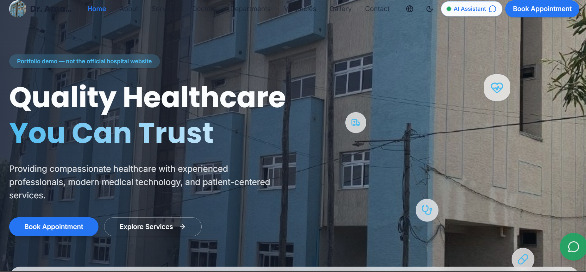

<div align="center">

# 🏥 Dr. Amanuel Hospital Management System

### *Modern Healthcare Platform for Digital Hospital Operations*

[](https://amanuelhospital.netlify.app/)
[](https://github.com/mesudhassen5450-sketch/Amanuel-Hospital)
[](#-license)



*A comprehensive full-stack hospital management system integrating public services, clinical operations, and administrative workflows.*

</div>

---

## 📋 **Quick Overview**

**Dr. Amanuel Hospital Management System** is a modern web-based platform designed to digitize and streamline healthcare delivery. Built during the **Sof Omar Technologies Internship Program**, this system addresses the gap between public-facing hospital services and internal clinical workflows. It serves patients, doctors, administrative staff, and hospital management with a unified, efficient digital solution.

---

## ⭐ **Key Features**

<table>
<tr>
<td width="50%">

### 🌐 **Public Services**
- 🏛️ Hospital information & services
- 👨‍⚕️ Doctor profiles & specializations
- 🏥 Department showcase
- 📅 Online appointment booking
- 🖼️ Facility gallery
- 🌍 Multilingual support (English, Amharic, Oromo)
- 🤖 AI-powered chatbot assistant

</td>
<td width="50%">

### 👤 **Patient Management**
- 📝 Patient registration system
- 🔢 Automatic MRN generation
- 📂 Digital patient profiles
- 🔗 Appointment-patient linking
- 📊 Medical history tracking
- 💊 Prescription management

</td>
</tr>
<tr>
<td width="50%">

### 👨‍⚕️ **Clinical Workflow**
- 📊 Doctor dashboard
- 👥 Real-time patient queue
- 🩺 Digital consultations
- 📋 Vital signs recording
- 💬 Clinical notes
- 📝 Diagnosis & treatment plans
- 🎥 Telemedicine video consultations

</td>
<td width="50%">

### 🔐 **Security & Admin**
- 🔒 JWT-based authentication
- 👮 Role-based access control (RBAC)
- 🛡️ Protected staff routes
- 🔑 Secure session management
- 👨‍💼 Admin dashboard
- 👥 Staff account management
- 📈 System analytics

</td>
</tr>
</table>

<details>
<summary><b>🧪 Laboratory Features</b></summary>

- 📋 Lab test requests
- 🔬 Result entry & management
- 📊 Test tracking
- 👨‍🔬 Technician workflow

</details>

<details>
<summary><b>💊 Pharmacy Features</b></summary>

- 💊 Medicine inventory
- 📝 Prescription processing
- 🏪 Dispensing workflow
- 📦 Stock management

</details>

<details>
<summary><b>💳 Payment System</b></summary>

- 💰 Payment calculation with tax
- 💳 Multiple payment methods
- 📄 Invoice generation
- 📊 Payment tracking

</details>

---

## 🏗️ **System Architecture**

```
                    👥 Patients & Staff
                           │
                           ▼
        ┌──────────────────────────────────┐
        │   React 19 + TypeScript          │
        │   TanStack Start + Tailwind CSS  │
        └─────────────┬────────────────────┘
                      │
                      │ HTTPS / WebSocket
                      │
        ┌─────────────▼────────────────────┐
        │   Express.js Backend Server      │
        │   Socket.IO + Prisma ORM         │
        └─────────────┬────────────────────┘
                      │
                      │ PostgreSQL Protocol
                      │
        ┌─────────────▼────────────────────┐
        │   Supabase PostgreSQL Database   │
        │   Multi-schema (auth, public)    │
        └──────────────────────────────────┘
```

---

## 🛠️ **Technology Stack**

| Layer | Technology |
|-------|-----------|
| **Frontend** | React 19, TypeScript, TanStack Start |
| **Styling** | Tailwind CSS v4, Radix UI |
| **Backend** | Node.js, Express.js, TypeScript |
| **Database** | PostgreSQL (Supabase) |
| **ORM** | Prisma |
| **Real-time** | Socket.IO, WebRTC |
| **Authentication** | JWT (jsonwebtoken) |
| **Password Security** | bcryptjs |
| **Deployment** | Netlify (Frontend), Render (Backend) |
| **Version Control** | Git & GitHub |

---

## 📈 **Development Journey**

```
🏗️ Phase 1: Foundation
   Database schema & appointment booking system
                    ↓
👤 Phase 4: Patient Management
   Patient registration with automatic MRN generation
                    ↓
🩺 Phase 5: Clinical Operations
   Doctor dashboard & electronic health records
                    ↓
🧪 Phase 6: Laboratory Integration
   Lab test requests & results management
                    ↓
💊 Phase 7: Pharmacy Module
   Medicine inventory & prescription dispensing
                    ↓
💬 Phase 8: Communication
   Integrated messaging & telemedicine consultations
                    ↓
🔐 Phase 9: Security & Administration
   JWT authentication, RBAC, and admin dashboard
```

---

## 🚀 **Getting Started**

### Prerequisites
- Node.js 20+ 
- npm or bun
- PostgreSQL database (or Supabase account)

### Installation

```bash
# Clone the repository
git clone https://github.com/mesudhassen5450-sketch/Amanuel-Hospital.git
cd Amanuel-Hospital

# Install frontend dependencies
npm install

# Install backend dependencies
cd server
npm install
cd ..

# Set up environment variables
cp .env.example .env
cp server/.env.example server/.env
# Edit .env files with your credentials

# Run database migrations (backend)
cd server
npx prisma generate
npx prisma db push
cd ..

# Start development servers
npm run dev           # Frontend (Terminal 1)
cd server && npm run dev  # Backend (Terminal 2)
```

### Access
- **Frontend:** http://localhost:3000
- **Backend API:** http://localhost:3001

---

## 🔐 **Environment Variables**

### Frontend `.env`
```env
VITE_SUPABASE_URL=your_supabase_project_url
VITE_SUPABASE_ANON_KEY=your_supabase_anon_key
VITE_API_URL=http://localhost:3001
DATABASE_URL=your_database_connection_string
```

### Backend `server/.env`
```env
PORT=3001
NODE_ENV=development
JWT_SECRET=your_secure_jwt_secret
DATABASE_URL=your_database_url_with_pgbouncer
DIRECT_URL=your_direct_database_url
CORS_ORIGIN=http://localhost:3000
```

> ⚠️ **Important:** Never commit `.env` files or expose real credentials!

---

## 🧪 **Tested Workflows**

<details>
<summary><b>✅ All Major Workflows Verified</b></summary>

<br>

| Status | Workflow | Description |
|:---:|---|---|
| ✅ | **Public Website** | Hospital info, services, doctor profiles |
| ✅ | **Appointment Booking** | Online scheduling with payment |
| ✅ | **Patient Registration** | New patient enrollment |
| ✅ | **MRN Generation** | Automatic medical record numbers |
| ✅ | **Reception Workflow** | Check-in and queue management |
| ✅ | **Doctor Consultation** | Clinical examinations and notes |
| ✅ | **Laboratory Workflow** | Test requests and results |
| ✅ | **Pharmacy Workflow** | Prescription dispensing |
| ✅ | **Payment Processing** | Billing calculations |
| ✅ | **Staff Authentication** | Secure login system |
| ✅ | **RBAC** | Role-based permissions |
| ✅ | **Admin Dashboard** | Staff & system management |
| ✅ | **Telemedicine** | Video consultations (WebRTC) |

</details>

---

## 📸 **Screenshots**

<details>
<summary><b>🖼️ View Application Screenshots</b></summary>

<br>

### 🏠 Homepage


### 🌐 Services Page


*Additional screenshots available in `/scrren` directory*

</details>

---

## 📁 **Project Structure**

```
Amanuel-Hospital/
├── src/                    # Frontend source
│   ├── components/         # React components
│   ├── routes/            # Page components
│   ├── lib/               # Utilities & configs
│   └── assets/            # Images & media
├── server/                # Backend source
│   ├── src/
│   │   ├── controllers/   # Route controllers
│   │   ├── routes/        # API routes
│   │   ├── middlewares/   # Auth & validation
│   │   └── sockets/       # Socket.IO handlers
│   └── prisma/
│       └── schema.prisma  # Database schema
├── public/                # Static assets
├── .env.example           # Environment template
└── README.md              # This file
```

---

## 🔐 **Security Features**

- 🔒 **JWT Authentication** - Secure token-based auth
- 👮 **Role-Based Access Control** - Fine-grained permissions
- 🛡️ **Protected Routes** - Server-side authorization
- 🔑 **Password Hashing** - bcrypt encryption
- 🚪 **Session Management** - Secure session handling
- 🌐 **CORS Protection** - Origin validation
- 🔐 **Environment Variables** - Sensitive data protection

---

## 👨‍💻 **Author**

<div align="center">

### **Mesud Hassen**

🎓 Information Technology Student  
🏫 Haramaya University, College of Computing and Informatics  
🇪🇹 Ethiopia

[](https://github.com/mesudhassen5450-sketch)
[](https://www.linkedin.com/in/mesud-mesman-837466413/)

</div>

---

## 🎓 **Internship Program**

This project was developed as part of the **Sof Omar Technologies Internship Program**, demonstrating practical full-stack development skills and real-world healthcare IT solutions.

---

## 📜 **License**

This project is licensed under the **MIT License** - see the LICENSE file for details.

---

## 🙏 **Acknowledgments**

Special thanks to:
- **Sof Omar Technologies** for the internship opportunity
- **Dr. Amanuel Hospital** for the project inspiration
- Open-source community for the amazing tools and libraries

---

<div align="center">

### **Built with ❤️, curiosity, and continuous learning**

[](https://github.com/mesudhassen5450-sketch/Amanuel-Hospital)

**[⬆ Back to Top](#-dr-amanuel-hospital-management-system)**

</div>
